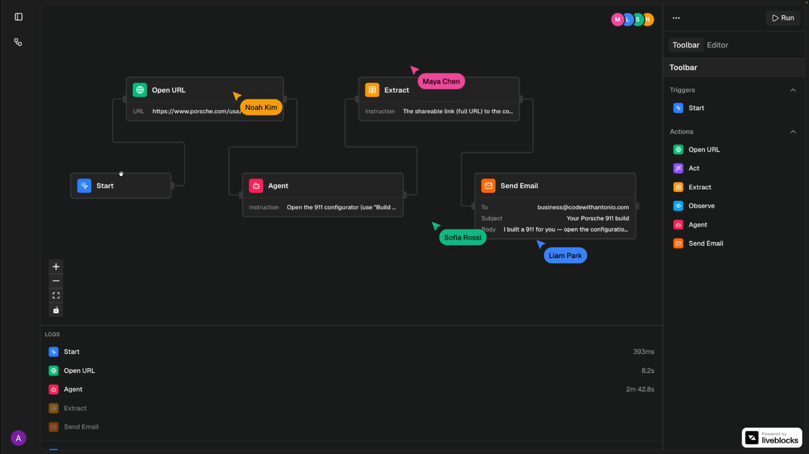
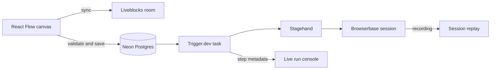

<div align="center">

<br />
<br />

<h1>Browser Automation SaaS</h1>

<p><strong>Design in real time. Execute in cloud browsers. Replay every run.</strong></p>

<p>A collaborative visual workflow builder powered by Stagehand, Browserbase, Trigger.dev, and Liveblocks.</p>

<p>
  <a href="#features">Features</a>&nbsp;&nbsp;&bull;&nbsp;&nbsp;
  <a href="#workflow-nodes">Nodes</a>&nbsp;&nbsp;&bull;&nbsp;&nbsp;
  <a href="#getting-started">Quick start</a>&nbsp;&nbsp;&bull;&nbsp;&nbsp;
  <a href="#deploy-on-railway">Deploy</a>&nbsp;&nbsp;&bull;&nbsp;&nbsp;
  <a href="#how-it-works">Architecture</a>&nbsp;&nbsp;&bull;&nbsp;&nbsp;
  <a href="#tutorial">Tutorial</a>
</p>

<br />

<p>
  <a href="https://cwa.run/browserbase"></a>&nbsp;
  <a href="https://cwa.run/trigger"></a>&nbsp;
  <a href="https://cwa.run/liveblocks"></a>&nbsp;
  <a href="https://cwa.run/neon"></a>&nbsp;
  <a href="https://cwa.run/clerk"></a>&nbsp;
  <a href="https://cwa.run/sentry"></a>&nbsp;
  <a href="https://cwa.run/railway"></a>
</p>

</div>

<br />



<p align="center"><sub>Build together on a live canvas, then follow every node from execution to output.</sub></p>

<br />

> Build automations as connected nodes, watch every step execute live, and inspect the complete browser session when the run is finished.

---

## Tutorial

<p align="center">
  <a href="https://www.youtube.com/watch?v=1hnyCQW-B4A"></a>
</p>

Each chapter has a matching branch so you can check out the code at any point in the tutorial:

| Branch | Chapter |
|--------|---------|
| `main` | Final project |
| `chapter-02-agentic-coding-setup` | Agentic coding setup |
| `chapter-03-auth-setup` | Clerk authentication setup |
| `chapter-04-organizations-setup` | Clerk organizations setup |
| `chapter-05-dashboard-layout` | Dashboard layout |
| `chapter-06-database-setup` | Neon and Drizzle database setup |
| `chapter-07-workflow-page` | Workflow page |
| `chapter-08-trigger-dev-setup` | Trigger.dev setup |
| `chapter-09-canvas-setup` | React Flow canvas setup |
| `chapter-10-custom-nodes` | Custom workflow nodes |
| `chapter-11-liveblocks-setup` | Liveblocks collaboration setup |
| `chapter-12-liveblocks-auth` | Liveblocks authentication |
| `chapter-13-names-and-avatars` | Collaborator names and avatars |
| `chapter-14-workflow-toolbar` | Workflow toolbar |
| `chapter-15-workflow-execution` | Workflow execution |
| `chapter-16-browserbase-setup` | Browserbase and Stagehand setup |
| `chapter-17-data-passthrough` | Data passthrough between nodes |
| `chapter-18-live-run-status` | Live workflow run status |
| `chapter-19-remaining-nodes` | Additional browser nodes |
| `chapter-20-email-node` | Resend email node |
| `chapter-21-console-panel` | Run console panel |
| `chapter-22-session-replay` | Browserbase session replay |
| `chapter-23-billing` | Clerk Billing and Pro features |
| `chapter-24-sentry-setup` | Sentry monitoring setup |
| `chapter-25-polish` | Final product polish |

```bash
git checkout chapter-16-browserbase-setup  # example: jump to Browserbase setup
```

---

## Features

<table>
  <tr>
    <td width="50%" valign="top">
      <strong>Visual workflow canvas</strong><br />
      Compose browser automations with draggable, connectable React Flow nodes.
    </td>
    <td width="50%" valign="top">
      <strong>Real-time collaboration</strong><br />
      Edit together with Liveblocks-powered shared state, cursors, and presence.
    </td>
  </tr>
  <tr>
    <td width="50%" valign="top">
      <strong>AI browser actions</strong><br />
      Navigate, act, observe, extract, and run autonomous tasks with Stagehand.
    </td>
    <td width="50%" valign="top">
      <strong>Connected data</strong><br />
      Pass outputs downstream with <code>{{ nodeId.path }}</code> expressions.
    </td>
  </tr>
  <tr>
    <td width="50%" valign="top">
      <strong>Durable execution</strong><br />
      Run long-lived Trigger.dev tasks with retries, cancellation, and live status.
    </td>
    <td width="50%" valign="top">
      <strong>Run observability</strong><br />
      Inspect step timing, outputs, failures, and complete Browserbase replays.
    </td>
  </tr>
  <tr>
    <td width="50%" valign="top">
      <strong>Organization workspaces</strong><br />
      Isolate workflows and collaborative rooms by Clerk organization.
    </td>
    <td width="50%" valign="top">
      <strong>SaaS-ready foundation</strong><br />
      Ship with Clerk Billing gates, Resend email nodes, and Sentry monitoring.
    </td>
  </tr>
</table>

<br />

## Workflow Nodes

| Node | Description | Outputs |
|------|-------------|---------|
| Start | Starts a connected workflow | None |
| Open URL | Navigates the shared browser session to a URL | URL, title |
| Act | Performs a natural-language browser action | Success, message, URL |
| Extract | Extracts page content from a natural-language instruction | Extraction |
| Observe | Finds matching browser elements and actions | Matches, selector, description |
| Agent | Runs a multi-step autonomous browser task | Success, message, completed |
| Send Email | Sends an HTML email through Resend | Email ID |

---

## Getting Started

### Prerequisites

- Node.js and npm
- [Clerk](https://cwa.run/clerk) application with Organizations enabled
- PostgreSQL database, such as [Neon](https://cwa.run/neon)
- [Trigger.dev](https://cwa.run/trigger) project
- [Liveblocks](https://cwa.run/liveblocks) project
- [Browserbase](https://cwa.run/browserbase) account
- [Resend](https://resend.com/) account
- Optional [Sentry](https://cwa.run/sentry) project for error monitoring and source maps

### 1. Clone and install

```bash
git clone git@github.com:code-with-antonio/browser-automation-app.git
cd browser-automation-app
npm install
```

### 2. Configure environment

```bash
cp .env.example .env.local
```

Fill in the service credentials in `.env.local`:

```bash
NEXT_PUBLIC_CLERK_SIGN_IN_URL=/sign-in
NEXT_PUBLIC_CLERK_SIGN_UP_URL=/sign-up
NEXT_PUBLIC_CLERK_SIGN_IN_FALLBACK_REDIRECT_URL=/
NEXT_PUBLIC_CLERK_SIGN_UP_FALLBACK_REDIRECT_URL=/

NEXT_PUBLIC_CLERK_PUBLISHABLE_KEY=
CLERK_SECRET_KEY=

NEON_BRANCH=main
DATABASE_URL=
DATABASE_URL_UNPOOLED=

TRIGGER_SECRET_KEY=

NEXT_PUBLIC_LIVEBLOCKS_PUBLIC_KEY=
LIVEBLOCKS_SECRET_KEY=

BROWSERBASE_API_KEY=
RESEND_API_KEY=

NEXT_PUBLIC_SENTRY_DSN=
SENTRY_DSN=
SENTRY_AUTH_TOKEN=
```

### 3. Configure Clerk

Create a Clerk application and enable Organizations. The dashboard requires an active organization, and every workflow is scoped to the current organization.

To enable paid features, configure Clerk Billing with an organization plan whose slug is exactly `pro`. Agent nodes and Browserbase session replay check this plan in both the UI and server-side actions.

### 4. Set up the database

Generate and apply the Drizzle migrations:

```bash
npm run db:generate
npm run db:migrate
```

For local prototyping, you can push the schema directly:

```bash
npm run db:push
```

`DATABASE_URL_UNPOOLED` is preferred for migrations. Drizzle falls back to `DATABASE_URL` when the unpooled URL is unavailable.

### 5. Configure integrations

Create projects in Trigger.dev and Liveblocks, then add their keys to `.env.local`. Add your Browserbase API key for Stagehand execution and session replay, and a Resend API key for the Send Email node.

The Stagehand model runs through Browserbase Model Gateway, so no separate model-provider API key is required.

### 6. Run Trigger.dev

Start the Trigger.dev development worker in a separate terminal:

```bash
npx trigger.dev dev
```

The worker discovers tasks under `features/` using `trigger.config.ts`.

### 7. Run the app

```bash
npm run dev
```

Open [http://localhost:3000](http://localhost:3000), sign in, select or create an organization, and create your first workflow.

---

## Deploy on Railway

[Railway](https://cwa.run/railway) can build and host the Next.js application directly from this repository.

### 1. Create the service

Push the repository to GitHub, create a Railway project, and choose **Deploy from GitHub repo**. Railway Railpack detects the Node.js application and installs dependencies from `package-lock.json`.

If automatic detection needs to be overridden, use:

| Setting | Value |
|---------|-------|
| Build command | `npm run build` |
| Start command | `npm start` |

You can also deploy the current directory with the Railway CLI:

```bash
railway login
railway init
railway up --detach -m "Initial deployment"
```

### 2. Add production variables

Copy the values from `.env.local` into the Railway service variables. Use production credentials for Clerk, Neon, Trigger.dev, Liveblocks, Browserbase, Resend, and Sentry.

```bash
NEXT_PUBLIC_CLERK_SIGN_IN_URL=/sign-in
NEXT_PUBLIC_CLERK_SIGN_UP_URL=/sign-up
NEXT_PUBLIC_CLERK_SIGN_IN_FALLBACK_REDIRECT_URL=/
NEXT_PUBLIC_CLERK_SIGN_UP_FALLBACK_REDIRECT_URL=/

NEXT_PUBLIC_CLERK_PUBLISHABLE_KEY=
CLERK_SECRET_KEY=

DATABASE_URL=
DATABASE_URL_UNPOOLED=
TRIGGER_SECRET_KEY=
NEXT_PUBLIC_LIVEBLOCKS_PUBLIC_KEY=
LIVEBLOCKS_SECRET_KEY=
BROWSERBASE_API_KEY=
RESEND_API_KEY=

NEXT_PUBLIC_SENTRY_DSN=
SENTRY_DSN=
SENTRY_AUTH_TOKEN=
```

`SENTRY_AUTH_TOKEN` is only required when uploading source maps during the production build.

### 3. Prepare production services

Apply the committed Drizzle migrations to the production database before serving traffic:

```bash
npm run db:migrate
```

Deploy the workflow task to Trigger.dev separately. Railway hosts the Next.js application, while Trigger.dev executes the durable background workflows:

```bash
npx trigger.dev deploy
```

Make sure the Railway service uses the production `TRIGGER_SECRET_KEY` from the same Trigger.dev project and environment.

### 4. Configure the domain

Generate a Railway domain from the service settings or connect a custom domain. Add the production domain to your Clerk application and any service allowlists that restrict application origins.

Every push to the connected branch creates a new Railway deployment. Check the build and runtime logs from the Railway dashboard if a release fails.

---

## How It Works



1. **Design** - Liveblocks synchronizes nodes, edges, cursors, and presence on the React Flow canvas.
2. **Validate** - Running a workflow validates the graph and saves its current snapshot to Postgres.
3. **Schedule** - Trigger.dev topologically sorts connected nodes and executes them in dependency order.
4. **Automate** - Browser nodes share one Browserbase-backed Stagehand session for the entire run.
5. **Connect** - Node outputs are stored by node ID and interpolated into downstream inputs.
6. **Observe** - Trigger.dev streams step status, timing, outputs, and errors back to the console.
7. **Replay** - Completed browser runs expose their recording through a server-side replay proxy.

<br />

## Project Structure

```text
app/
├── (auth)/                     # Clerk sign-in, sign-up, and organization selection
├── (dashboard)/                # Workflow dashboard, editor, and billing page
└── api/
    ├── liveblocks/             # Liveblocks authentication and user resolution
    └── replays/                # Browserbase recording proxy
components/
├── app-sidebar.tsx             # Organization and workflow navigation
└── ui/                         # Shared UI primitives
features/
└── workflows/
    ├── components/             # Canvas, toolbar, inspector, console, and replay UI
    ├── hooks/                  # Billing plan and graph connection hooks
    ├── lib/                    # Validation, interpolation, and workflow utilities
    ├── nodes/                  # Node registry and executor implementations
    ├── tasks/                  # Trigger.dev workflow runner
    ├── actions.ts              # Workflow mutations, execution, and cancellation
    └── data.ts                 # Organization-scoped workflow queries
lib/
├── db/                         # Drizzle schema, Neon client, and migrations
├── browserbase.ts              # Browserbase SDK client
├── liveblocks.ts               # Liveblocks server client
└── resend.ts                   # Resend client
```

---

## Scripts

| Command | Description |
|---------|-------------|
| `npm run dev` | Start the Next.js development server |
| `npm run build` | Create a production build |
| `npm start` | Start the production server |
| `npm run lint` | Run ESLint |
| `npm run format` | Format TypeScript and TSX files with Prettier |
| `npm run typecheck` | Run TypeScript without emitting files |
| `npm run db:generate` | Generate Drizzle migrations |
| `npm run db:migrate` | Apply Drizzle migrations |
| `npm run db:push` | Push the Drizzle schema directly to the database |
| `npm run db:studio` | Open Drizzle Studio |

<br />

## Stack

| Technology | Purpose |
|------------|---------|
| Next.js 16 and React 19 | Application framework and interface |
| React Flow | Visual workflow canvas |
| Liveblocks | Collaborative graph state, cursors, and presence |
| Trigger.dev | Durable workflow execution, retries, cancellation, and live run metadata |
| Stagehand | AI-powered browser actions, extraction, observation, and agents |
| Browserbase | Managed browser sessions, model gateway, and session recordings |
| Clerk | Authentication, organizations, and subscription plans |
| Neon and Drizzle | Serverless Postgres and typed database access |
| Resend | Email workflow execution |
| Sentry | Frontend, server, edge, and background-task monitoring |
